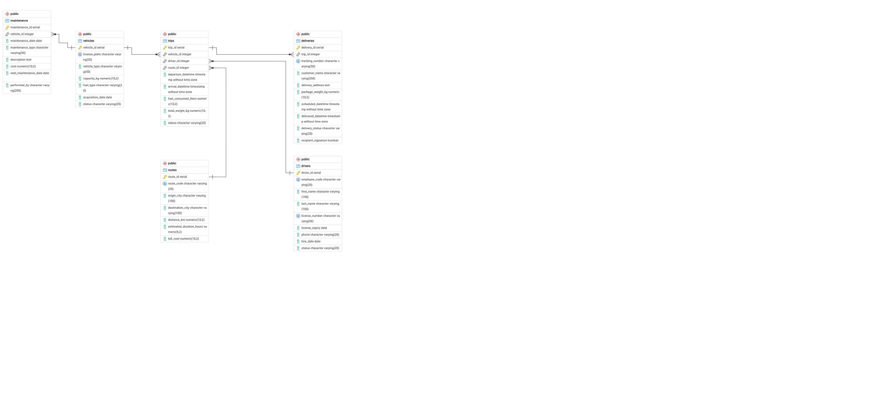

# Análisis del Modelo Relacional — FleetLogix

Documentación de las relaciones, claves y restricciones del modelo relacional proporcionado en `fleetlogix_db_schema.sql`, como parte del Avance #1 del Proyecto Integrador.

---

## 📐 Resumen visual del modelo

- `vehicles`, `drivers` y `routes` son tablas **maestras** (independientes, sin FK propias).
- `trips` es la tabla **central**: depende de las tres maestras y es el puente hacia `deliveries`.
- `deliveries` y `maintenance` son tablas **transaccionales dependientes**, no pueden existir sin su tabla padre.

---

## 1. `vehicles`

| Elemento | Detalle |
|---|---|
| **Primary Key** | `vehicle_id` (SERIAL, autoincremental) |
| **Foreign Keys** | Ninguna — tabla maestra/independiente |
| **UNIQUE** | `license_plate` — no puede haber dos vehículos con la misma placa |
| **NOT NULL** | `license_plate`, `vehicle_type` |
| **DEFAULT** | `status = 'active'` |
| **Índice adicional** | `idx_vehicles_status` sobre `status` |

**Relaciones:**
- `vehicles` → `trips`: **1:N**. Un vehículo puede realizar muchos viajes; un viaje pertenece a un solo vehículo (`trips.vehicle_id`).
- `vehicles` → `maintenance`: **1:N**. Un vehículo puede tener muchos registros de mantenimiento; un mantenimiento corresponde a un solo vehículo (`maintenance.vehicle_id`).

---

## 2. `drivers`

| Elemento | Detalle |
|---|---|
| **Primary Key** | `driver_id` (SERIAL) |
| **Foreign Keys** | Ninguna — tabla maestra independiente |
| **UNIQUE** | `employee_code`, `license_number` — ningún conductor puede repetir código de empleado ni número de licencia |
| **NOT NULL** | `employee_code`, `first_name`, `last_name`, `license_number` |
| **DEFAULT** | `status = 'active'` |

**Relaciones:**
- `drivers` → `trips`: **1:N**. Un conductor puede realizar muchos viajes; un viaje tiene un solo conductor asignado (`trips.driver_id`).

---

## 3. `routes`

| Elemento | Detalle |
|---|---|
| **Primary Key** | `route_id` (SERIAL) |
| **Foreign Keys** | Ninguna — tabla maestra independiente |
| **UNIQUE** | `route_code` |
| **NOT NULL** | `route_code`, `origin_city`, `destination_city` |
| **DEFAULT** | `toll_cost = 0` |

**Relaciones:**
- `routes` → `trips`: **1:N**. Una ruta puede ser recorrida en muchos viajes; cada viaje sigue una sola ruta (`trips.route_id`).

---

## 4. `trips`

| Elemento | Detalle |
|---|---|
| **Primary Key** | `trip_id` (SERIAL) |
| **Foreign Keys** | `vehicle_id → vehicles(vehicle_id)` · `driver_id → drivers(driver_id)` · `route_id → routes(route_id)` |
| **NOT NULL** | `departure_datetime` |
| **DEFAULT** | `status = 'in_progress'` |
| **Índice adicional** | `idx_trips_departure` sobre `departure_datetime` |

**Relaciones:**
- `trips` → `vehicles`: **N:1**. Muchos viajes pueden compartir el mismo vehículo.
- `trips` → `drivers`: **N:1**. Muchos viajes pueden compartir el mismo conductor.
- `trips` → `routes`: **N:1**. Muchos viajes pueden compartir la misma ruta.
- `trips` → `deliveries`: **1:N**. Un viaje puede tener muchas entregas asociadas; cada entrega pertenece a un solo viaje (`deliveries.trip_id`).

`trips` es la **entidad asociativa** del modelo: no representa una relación N:M pura entre `vehicles`/`drivers`/`routes` (cada viaje tiene exactamente un vehículo, un conductor y una ruta a la vez), pero sí es el punto donde convergen las tres tablas maestras.

---

## 5. `deliveries`

| Elemento | Detalle |
|---|---|
| **Primary Key** | `delivery_id` (SERIAL) |
| **Foreign Keys** | `trip_id → trips(trip_id)` |
| **UNIQUE** | `tracking_number` — cada entrega tiene un número de rastreo irrepetible |
| **NOT NULL** | `tracking_number`, `customer_name`, `delivery_address` |
| **DEFAULT** | `delivery_status = 'pending'` · `recipient_signature = FALSE` |
| **Índice adicional** | `idx_deliveries_status` sobre `delivery_status` |

**Relaciones:**
- `deliveries` → `trips`: **N:1**. Muchas entregas pertenecen a un mismo viaje; una entrega no puede existir sin un viaje válido.

---

## 6. `maintenance`

| Elemento | Detalle |
|---|---|
| **Primary Key** | `maintenance_id` (SERIAL) |
| **Foreign Keys** | `vehicle_id → vehicles(vehicle_id)` |
| **NOT NULL** | `maintenance_date`, `maintenance_type` |
| **DEFAULT** | Ninguno explícito |

**Relaciones:**
- `maintenance` → `vehicles`: **N:1**. Muchos registros de mantenimiento pertenecen a un mismo vehículo; un mantenimiento no puede existir sin un vehículo válido.

---

## 📋 Tabla resumen de cardinalidades

| Relación | Tipo | Columna FK | Regla que garantiza |
|---|---|---|---|
| `vehicles` – `trips` | 1:N | `trips.vehicle_id` | Un viaje siempre tiene un vehículo real asignado |
| `drivers` – `trips` | 1:N | `trips.driver_id` | Un viaje siempre tiene un conductor real asignado |
| `routes` – `trips` | 1:N | `trips.route_id` | Un viaje siempre sigue una ruta real |
| `trips` – `deliveries` | 1:N | `deliveries.trip_id` | Una entrega siempre pertenece a un viaje real |
| `vehicles` – `maintenance` | 1:N | `maintenance.vehicle_id` | Un mantenimiento siempre corresponde a un vehículo real |

No existen relaciones **N:M** en este modelo — todas son 1:N, resueltas mediante una FK simple en la tabla del lado "muchos". No hay tablas puente/intermedias porque ninguna entidad necesita relacionarse con múltiples instancias de otra en ambos sentidos simultáneamente (por ejemplo, una entrega no se reparte entre varios viajes).

---

## 🔒 Restricciones de unicidad — resumen

| Tabla | Columna UNIQUE | Por qué |
|---|---|---|
| `vehicles` | `license_plate` | Una placa identifica a un único vehículo físico |
| `drivers` | `employee_code` | Código interno de empleado, no puede duplicarse |
| `drivers` | `license_number` | Número de licencia de conducir, único por persona |
| `routes` | `route_code` | Identificador de ruta interno de la empresa |
| `deliveries` | `tracking_number` | Número de rastreo que el cliente usa para seguir su paquete |

---

## ⚡ Índices creados

| Índice | Tabla.Columna | Propósito |
|---|---|---|
| `idx_trips_departure` | `trips.departure_datetime` | Acelerar consultas por rango de fechas. |
| `idx_deliveries_status` | `deliveries.delivery_status` | Acelerar filtros por estado. |
| `idx_vehicles_status` | `vehicles.status` | Acelerar filtros de flota activa vs. en mantenimiento. |

---

## 🔍 Patrones de negocio implícitos y mejoras justificadas

El schema, tal como fue provisto, revela varios supuestos sobre qué necesita (o no necesita) resolver el negocio en esta etapa. A continuación se analizan tres casos, sin modificar la estructura base.

### 1. Clientes sin identidad propia (`deliveries.customer_name`)

**Patrón implícito:** El modelo asume que **no es necesario reconocer clientes recurrentes**. `customer_name` se guarda como texto libre (`VARCHAR(200)`), sin ningún identificador único que lo relacione entre distintas entregas. Esto sugiere que, en esta etapa, el negocio prioriza el registro operativo de "a quién se le entregó este paquete puntual" por sobre el análisis de comportamiento de clientes.

**Por qué es una limitación real:** una query como `WHERE customer_name = 'Juan Pérez'` no garantiza que todas las filas devueltas sean la misma persona (puede haber homónimos), ni agrupa correctamente si el mismo cliente fue registrado con variaciones de escritura (con/sin tilde, mayúsculas distintas, etc.).

**Pregunta de negocio bloqueada:** *"¿Quiénes son los clientes más frecuentes?"* o *"¿qué porcentaje de clientes son recurrentes vs. de una sola vez?"* — imposible de responder con confianza en el estado actual.

**Mejora justificada:** Crear una tabla `customers` (`customer_id` PK) y reemplazar `deliveries.customer_name` por una FK `customer_id → customers(customer_id)`. Se justifica una tabla nueva (y no solo una columna) porque un mismo cliente se repite en **muchas filas de `deliveries`** a lo largo del tiempo — necesita un identificador estable para poder agruparse como una única entidad.

---

### 2. Viajes que solo pueden salir bien o estar en curso (`trips.status`)

**Patrón implícito:** El modelo asume que **todo viaje termina en éxito o queda en curso** — la única lógica de negocio detrás de `status` (`completed` / `in_progress`, según `generate_trips()`) no contempla cancelaciones por avería del vehículo, problema del conductor, o rechazo del cliente antes de salir.

**Pregunta de negocio bloqueada:** *"¿Qué porcentaje de viajes se cancelan, y por qué motivo?"* — no hay valor de `status` ni columna que lo represente.

**Mejora justificada:** Agregar el valor `'cancelled'` a `trips.status`, más una nueva columna `cancellation_type VARCHAR(50)` con una **lista cerrada** de motivos (ej. avería del vehículo, problema del conductor, cancelación del cliente), siguiendo el mismo patrón ya usado en `maintenance_type`. Se justifica una columna (y no una tabla nueva) porque el motivo es un dato **fijo por fila**: un viaje cancelado tiene un solo motivo, que no se repite ni varía en el tiempo.

**Trade-off a tener en cuenta:** una lista cerrada facilita el análisis (`GROUP BY cancellation_type` para saber el motivo más común) pero reduce flexibilidad — agregar un motivo nuevo no contemplado (ej. bloqueo de carretera) exige modificar el schema (`ALTER TABLE` / `ALTER TYPE`), a diferencia de un campo de texto libre.

**Nota de consistencia:** un viaje cancelado debería mantener `arrival_datetime = NULL`, igual que un viaje `in_progress`, ya que nunca llegó a destino.

---

### 3. Combustible sin costo real asociado (`trips.fuel_consumed_liters`, `vehicles.fuel_type`)

**Patrón implícito:** El modelo asume que **no es necesario calcular el costo real en dinero del combustible**. Se registran litros consumidos y tipo de combustible, pero no existe ningún precio asociado en ninguna tabla.

**Pregunta de negocio bloqueada:** *"¿Cuál fue el costo total en combustible de este viaje (o de toda la flota en un período)?"* — la fórmula necesaria sería `fuel_consumed_liters × precio_por_litro`, pero ese precio no existe en el modelo.

**Mejora justificada:** Crear una tabla nueva `fuel_prices` (`fecha`, `fuel_type`, `precio_por_litro`) y calcular el costo cruzando `trips.fuel_consumed_liters` con el precio correspondiente a la fecha del viaje. Se justifica una tabla nueva (y no una columna en `vehicles`) porque el precio del combustible **varía con el tiempo**.
