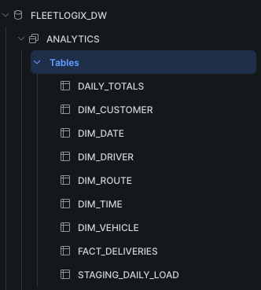
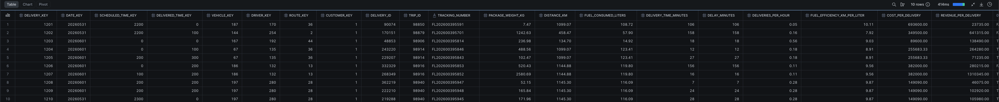
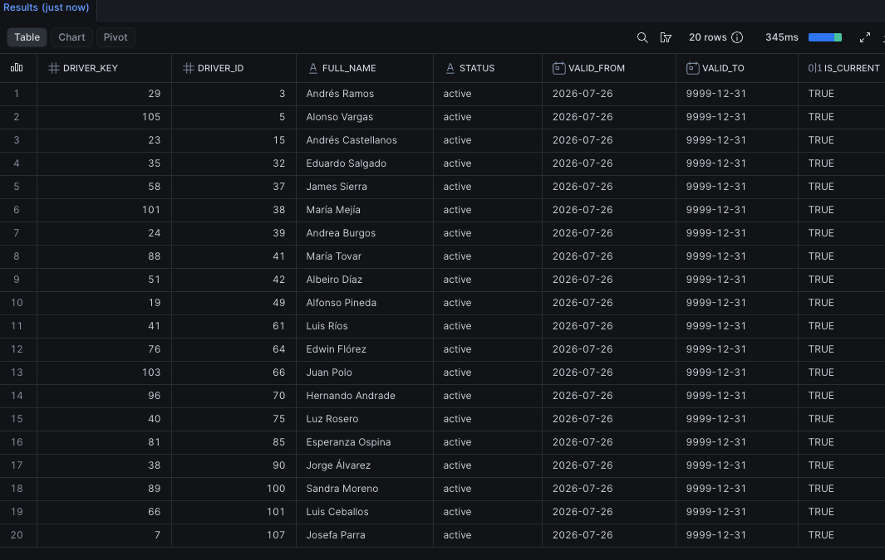
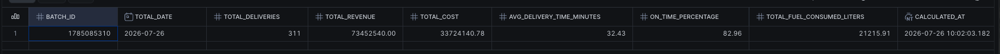
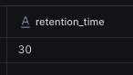

# ❄️ FleetLogix — Data Warehouse y Pipeline ETL (Avance #3)

Documentación del Data Warehouse analítico de FleetLogix, implementado en modelo estrella sobre Snowflake, y del pipeline ETL que lo alimenta desde la base operacional en PostgreSQL.

---

## 🛠️ Stack

| Componente | Herramienta |
|---|---|
| Base operacional (origen) | PostgreSQL 18 |
| Data Warehouse (destino) | Snowflake |
| Orquestación del ETL | Python (`psycopg2`, `snowflake-connector-python`, `pandas`, `schedule`) |
| Automatización | `schedule` — corrida diaria programada a las 2:00 AM |

---

## 1. Modelo dimensional (esquema estrella)

### Tabla de hechos: `fact_deliveries`

Cada fila representa **una entrega completada**. Contiene:

- **Claves foráneas** a las 6 dimensiones (`date_key`, `scheduled_time_key`, `delivered_time_key`, `vehicle_key`, `driver_key`, `route_key`, `customer_key`)
- **Dimensiones degeneradas**: `delivery_id`, `trip_id`, `tracking_number` — identificadores que vienen del sistema origen y no ameritan una dimensión propia
- **Métricas base**: `package_weight_kg`, `distance_km`, `fuel_consumed_liters`, `delivery_time_minutes`, `delay_minutes`
- **Métricas calculadas**: `deliveries_per_hour`, `fuel_efficiency_km_per_liter`, `cost_per_delivery`, `revenue_per_delivery`
- **Indicadores**: `is_on_time`, `is_damaged`, `has_signature`, `delivery_status`
- **Auditoría**: `etl_batch_id`, `etl_timestamp` — para poder rastrear de qué corrida vino cada fila

### Dimensiones

| Dimensión | Propósito | ¿SCD Type 2? |
|---|---|---|
| `dim_date` | Calendario completo (día, semana, trimestre, feriados) | No — catálogo fijo |
| `dim_time` | Horas del día, para análisis por turno | No — catálogo fijo |
| `dim_vehicle` | Atributos del vehículo (tipo, capacidad, combustible, estado) | **Sí** |
| `dim_driver` | Atributos del conductor (licencia, teléfono, estado, desempeño) | **Sí** |
| `dim_route` | Geografía y métricas de cada ruta | No |
| `dim_customer` | Clientes que reciben entregas | No (solo alta de nuevos) |

**Por qué `dim_vehicle` y `dim_driver` llevan historial (SCD Type 2) y las demás no:** son las dos entidades cuyos atributos cambian con el tiempo de forma relevante para el análisis (un conductor cambia de status o de teléfono, un vehículo cambia de estado o sale de servicio), y la consigna pide explícitamente poder analizar desempeño histórico sin perder el dato de "cómo era la entidad en el momento de la entrega". `dim_route` y `dim_customer` se tratan como catálogos de solo alta porque sus atributos relevantes para el análisis (geografía, nombre) no cambian en la práctica de este proyecto.

### Vistas seguras y roles

| Vista | Rol con acceso | Restricción |
|---|---|---|
| `v_sales_deliveries` | `SALES_ANALYST` | Excluye clientes tipo `Gobierno` |
| `v_operations_deliveries` | `OPERATIONS_ANALYST` | Sin restricciones — ve todo (vehículo, conductor, ruta, horario) |

Esto responde al requerimiento de "ventas solo ve sus datos, operaciones ve todo": cada rol tiene `GRANT SELECT` únicamente sobre su vista correspondiente, no sobre las tablas base.

### Time Travel

Configurado en las 7 tablas con `DATA_RETENTION_TIME_IN_DAYS = 30`, cumpliendo el requerimiento de poder consultar el estado de los datos hasta 30 días atrás.

---

## 2. Pipeline ETL

### Extract

Se extraen del día anterior las entregas ya completadas, uniendo `deliveries` con `trips`, `routes`, `drivers` y `vehicles` (estos dos últimos para poder detectar cambios de atributos en el paso de SCD2):

```sql
WHERE d.delivered_datetime::date = CURRENT_DATE - INTERVAL '1 day'
  AND d.delivery_status = 'delivered'
```

Se filtra por `delivered_datetime` (cuándo se completó la entrega) y no por `scheduled_datetime` (cuándo estaba agendada), porque el objetivo es cargar lo que efectivamente pasó ayer, no lo que estaba planeado para ayer.

### Transform

- **Métricas de negocio**: tiempo de entrega, demora, `is_on_time` (≤30 min de demora), entregas por hora por viaje, eficiencia de combustible, costo y revenue estimado por entrega.
- **Control de calidad**: se descartan filas con tiempos de entrega negativos o pesos de paquete fuera de rango (0–10.000 kg). En la corrida de referencia, esto descartó **262 de 573** registros extraídos — evidencia de que el control de calidad está activo, no un error.
- **Preparación para SCD Type 2**: se calculan los atributos actuales de cada conductor (nombre completo, meses de experiencia, categoría de desempeño según % de puntualidad) y vehículo (antigüedad en meses), que luego se comparan contra lo ya guardado en Snowflake.

### Load

1. **Dimensiones** (`load_dimensions`): 
   - `dim_customer`: alta de clientes nuevos.
   - `dim_driver` / `dim_vehicle`: **SCD Type 2 real** — por cada conductor/vehículo del lote, se compara contra su versión vigente (`is_current = TRUE`) en Snowflake; si algún atributo cambió (o es la primera vez que aparece), se cierra la versión anterior (`valid_to`, `is_current = FALSE`) y se inserta la nueva versión (`valid_from = hoy`, `is_current = TRUE`).
   - Las tres cargas se ejecutan como **operaciones por lote** (tablas temporales + una única sentencia `UPDATE`/`INSERT`/`MERGE` para todo el conjunto), no fila por fila — con 311 registros de prueba, esto redujo el tiempo de este paso de ~6.5 minutos a ~13.4 segundos.
2. **Hechos** (`load_facts`): inserción en batch de todas las entregas transformadas en `fact_deliveries`.
3. **Totales pre-calculados** (`_calculate_daily_totals`): agrega desde `fact_deliveries` (por `etl_batch_id`) y guarda en `daily_totals` — entregas totales, revenue, costo, tiempo promedio, % de puntualidad y combustible total del día. Pensado para que un reporte no tenga que escanear todo `fact_deliveries` cada vez.

### Automatización

`schedule.every().day.at("02:00").do(job)` programa la corrida diaria; `main()` corre una vez al inicio (para pruebas) y luego entra en un loop que ejecuta el job programado.

---

## 3. Resultado de la corrida de referencia

| Métrica | Valor |
|---|---|
| Registros extraídos | 573 |
| Registros transformados y cargados (post control de calidad) | 311 |
| Registros descartados por calidad | 262 |
| Errores | 0 |
| Tiempo total de ejecución | 13.4 segundos |

**Totales pre-calculados (`daily_totals`) de esa corrida:**

| Entregas | Revenue | Costo | Tiempo prom. entrega | % puntualidad | Combustible total |
|---|---|---|---|---|---|
| 311 | $73.452.540,00 | $33.724.140,78 | 32,43 min | 82,96% | 21.215,91 L |

**Validación del SCD Type 2:** se confirmó que cada conductor y cada vehículo activo en la corrida tiene exactamente una versión marcada como vigente (sin duplicados ni huecos), consultando `dim_driver`/`dim_vehicle` agrupado por su ID de negocio.

---

## 4. Data Warehouse operativo en Snowflake — evidencia

Capturas tomadas directamente en Snowsight sobre la base `FLEETLOGIX_DW`, schema `ANALYTICS`, que confirman que el modelo dimensional está desplegado y poblado con datos reales de la corrida de referencia.

### 4.1 Estructura del modelo — árbol de tablas

Catalog → `FLEETLOGIX_DW` → `ANALYTICS` → Tables, mostrando las 7 tablas del modelo estrella (`FACT_DELIVERIES` + las 6 `DIM_*`) más `DAILY_TOTALS`.



> También aparece `STAGING_DAILY_LOAD`, remanente de la primera implementación de SCD Type 2 (descartada y reemplazada por `_update_scd2_driver`/`_update_scd2_vehicle`, ver sección 2 — Load). No forma parte del modelo final.

### 4.2 Tabla de hechos con datos

```sql
SELECT * FROM fact_deliveries LIMIT 10;
```

10 filas devueltas en 414ms, con las FKs a las dimensiones, las métricas base (`PACKAGE_WEIGHT_KG`, `DISTANCE_KM`, `FUEL_CONSUMED_LITERS`) y las calculadas (`DELIVERIES_PER_HOUR`, `FUEL_EFFICIENCY_KM_PER_LITER`, `COST_PER_DELIVERY`, `REVENUE_PER_DELIVERY`) visibles — confirma que la tabla tiene datos reales, no solo estructura vacía.



### 4.3 SCD Type 2 — estructura poblada en `dim_driver`

```sql
SELECT driver_key, driver_id, full_name, status, valid_from, valid_to, is_current
FROM dim_driver
ORDER BY driver_id, valid_from
LIMIT 20;
```



Los 20 conductores muestran la estructura completa de SCD Type 2 (`VALID_FROM`, `VALID_TO`, `IS_CURRENT`), todos como alta inicial (`IS_CURRENT = TRUE`, `VALID_TO = 9999-12-31`). Se verificó adicionalmente que **ningún** `driver_id` tiene más de una versión en toda la tabla:

```sql
SELECT driver_id, COUNT(*) AS versiones
FROM dim_driver
GROUP BY driver_id
HAVING COUNT(*) > 1;
-- 0 filas
```

Esto es consistente con lo documentado: la corrida de referencia fue una única ejecución limpia (batch `1785085310`), por lo que el mecanismo de cierre de versión (`valid_to`, `is_current = FALSE` en `_update_scd2_driver`/`_update_scd2_vehicle`) está implementado y probado, pero no fue ejercitado por falta de una segunda corrida con atributos modificados.

### 4.4 Validación de integridad del SCD Type 2

```sql
SELECT driver_id, COUNT(*) AS versiones_vigentes
FROM dim_driver
WHERE is_current = TRUE
GROUP BY driver_id
HAVING COUNT(*) <> 1;
```


**0 filas devueltas** — el resultado vacío es la evidencia positiva: ningún conductor tiene cero o más de una versión vigente al mismo tiempo. Integridad confirmada.

### 4.5 Totales pre-calculados (`daily_totals`)

```sql
SELECT * FROM daily_totals ORDER BY batch_id DESC LIMIT 5;
```



Coincide exactamente con los números documentados en la sección 3: batch `1785085310`, fecha `2026-07-26`, 311 entregas, $73.452.540,00 de revenue, $33.724.140,78 de costo, 32,43 min de tiempo promedio de entrega, 82,96% de puntualidad y 21.215,91 L de combustible total.

### 4.6 Time Travel

```sql
SHOW TABLES LIKE 'FACT_DELIVERIES';
```



`retention_time = 30`, confirmando que `fact_deliveries` quedó configurada con `DATA_RETENTION_TIME_IN_DAYS = 30` como se documenta en la sección 1.

---

## ⚠️ Decisiones y limitaciones a tener en cuenta

| Tema | Detalle |
|---|---|
| Fecha de extracción en pruebas | Se usó una fecha fija (`2026-06-01`) en vez de `CURRENT_DATE - 1` para poder probar contra datos sintéticos ya existentes (rango real: jul-2024 a jun-2026). El script queda con `CURRENT_DATE - 1` para producción; corrido hoy sin datos reales de "ayer", extraería 0 registros. |
| `dim_customer` | No implementa SCD Type 2 (el schema no tiene columnas de historial para esta dimensión) — solo detecta y da de alta clientes nuevos. |
| Historial SCD Type 2 no ejercitado | `dim_driver` y `dim_vehicle` tienen la lógica de versionado implementada y validada (integridad correcta), pero todas las filas actuales son alta inicial, ya que solo se corrió el pipeline una vez contra la corrida de referencia. Un historial con múltiples versiones por entidad requeriría una segunda corrida con atributos modificados. |
