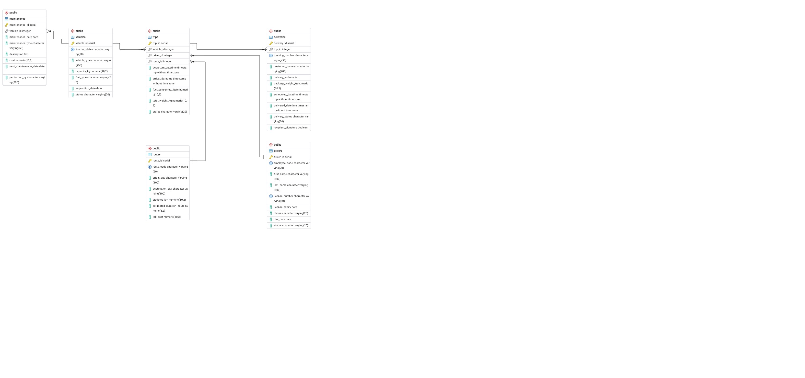
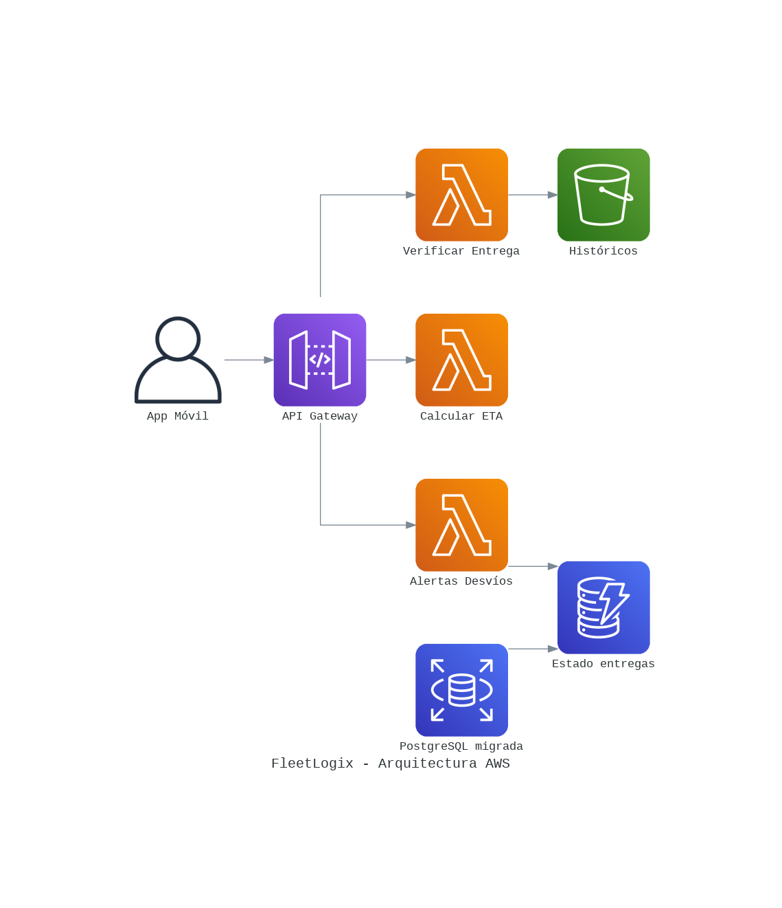

# 🚚 FleetLogix DB — Proyecto Integrador (Henry PIM2)

Sistema de datos end-to-end para **FleetLogix**, empresa ficticia de transporte y logística que opera una flota de 200 vehículos con entregas de última milla en 5 ciudades principales (Bogotá, Medellín, Cali, Barranquilla, Cartagena).

El proyecto recorre el ciclo completo de un producto de datos: desde el modelado relacional y la carga de datos sintéticos, pasando por el análisis y la optimización de queries, hasta un Data Warehouse analítico en la nube y el diseño de una arquitectura serverless para ingesta en tiempo real.

---

## 📌 Resumen de los 4 avances

| Avance | Foco | Entregable principal |
|---|---|---|
| **1** | Modelado relacional + generación de datos sintéticos | Base PostgreSQL poblada (505,650 registros) + diagrama ER + análisis del modelo |
| **2** | Queries de negocio + optimización con índices | 8 queries documentadas con `EXPLAIN ANALYZE` antes/después de indexar |
| **3** | Data Warehouse + pipeline ETL | Modelo estrella en Snowflake + pipeline Python con SCD Type 2 |
| **4** | Arquitectura Cloud (AWS) | Diseño serverless documentado (sin despliegue real) |

---

## 🛠️ Stack completo del proyecto

| Componente | Herramienta |
|---|---|
| Base de datos operacional | PostgreSQL 18 (Homebrew, nativo ARM64) |
| Clientes SQL | pgAdmin 4, VS Code + extensión `ms-ossdata.vscode-pgsql`, DBeaver |
| Generación de datos sintéticos | Python 3.10+ (`psycopg2`, `pandas`, `numpy`, `faker`, `tqdm`) |
| Data Warehouse | Snowflake (Enterprise Edition trial) |
| Orquestación ETL | Python (`snowflake-connector-python`, `pandas`, `schedule`) |
| Arquitectura Cloud (diseño) | AWS — API Gateway, Lambda, S3, DynamoDB, RDS, SNS, CloudWatch, IAM |
| Versionado | Git + GitHub |

---

## 1️⃣ Avance 1 — Modelo relacional y datos sintéticos

**Objetivo:** diseñar y poblar la base operacional de FleetLogix en PostgreSQL.

### Modelo de datos

6 tablas: `vehicles`, `drivers`, `routes` (maestras, sin FK propia), `trips` (entidad central, converge las 3 maestras), y `deliveries` / `maintenance` (transaccionales dependientes). Todas las relaciones son **1:N** — no hay tablas puente ni relaciones N:M.



| Tabla | PK | FKs | Relación |
|---|---|---|---|
| `vehicles` | `vehicle_id` | — | 1:N → `trips`, `maintenance` |
| `drivers` | `driver_id` | — | 1:N → `trips` |
| `routes` | `route_id` | — | 1:N → `trips` |
| `trips` | `trip_id` | `vehicle_id`, `driver_id`, `route_id` | 1:N → `deliveries` |
| `deliveries` | `delivery_id` | `trip_id` | — |
| `maintenance` | `maintenance_id` | `vehicle_id` | — |

Detalle completo de PKs, FKs, `UNIQUE`, `NOT NULL`, `DEFAULT` e índices en [`Analisis_Modelo_Relacional_FleetLogix.md`](Avance_1/Analisis_Modelo_Relacional_FleetLogix.md).

### Generación de datos sintéticos

Script Python (`A1-01_data_generation_estudiantes.py`) con `faker`, `numpy` y `psycopg2`. Conteos finales exactos, tras corregir 3 bugs de redondeo/corte encontrados en la primera corrida (ver sección de problemas):

| Tabla | Registros |
|---|---|
| `vehicles` | 200 |
| `drivers` | 400 |
| `routes` | 50 |
| `trips` | 100,000 |
| `deliveries` | 400,000 |
| `maintenance` | 5,000 |
| **TOTAL** | **505,650** |

Las 5 validaciones de `validate_data_quality()` (integridad referencial, consistencia temporal, capacidad de vehículos, tracking numbers) dieron **OK**.

### Patrones de negocio detectados (sin modificar el schema base)

| # | Patrón detectado | Mejora propuesta |
|---|---|---|
| 1 | `deliveries.customer_name` es texto libre, sin identidad de cliente | Tabla `customers` con FK `customer_id` |
| 2 | `trips.status` solo contempla `completed`/`in_progress`, sin cancelaciones | Valor `'cancelled'` + columna `cancellation_type` (lista cerrada) |
| 3 | No existe precio de combustible en el modelo | Tabla `fuel_prices` (varía en el tiempo → justifica tabla, no columna) |

### Problemas encontrados y soluciones

| Problema | Causa | Solución |
|---|---|---|
| `schema "np" does not exist` al insertar `deliveries` | `numpy.float64` sin convertir a `float` nativo | `package_weight = float(weights[i])` |
| `routes` daba 48 en vez de 50 | El `break` condicional nunca se disparaba (la combinatoria de ciudades sumaba exacto 48) | Completar con pares aleatorios adicionales hasta `count` |
| `maintenance` daba ~4,920 en vez de 5,000 | División entera (`trip_count // 20`) pierde el resto por vehículo | Completar con registros extra ponderados por cantidad de viajes |
| `deliveries` daba 400,001 en vez de 400,000 | Contador incrementado antes de chequear el límite | Generar sin cortar a mitad de viaje, recortar/completar al final |
| Password real embebida en el script, a punto de subirse a GitHub | `DB_CONFIG` con credenciales en el mismo `.py` | Separación en `db_config.py` (ignorado) + `db_config.example.py` (público) |
| Reintentar el script fallaba por clave duplicada | Semillas fijas (`seed=42`) regeneran los mismos datos | `TRUNCATE ... RESTART IDENTITY CASCADE` antes de cada corrida nueva |

---

## 2️⃣ Avance 2 — Queries de negocio y optimización con índices

**Objetivo:** transformar los registros en información de negocio y mejorar el rendimiento con índices.

### Trabajo realizado

1. Ejecución de las 12 queries provistas (3 básicas, 5 intermedias, 4 complejas); documentación final de **8**, priorizando cobertura de las tres categorías y conexión con los índices propuestos.
2. Análisis de plan de ejecución con `EXPLAIN ANALYZE` en cada una.
3. Creación de 5 índices de optimización.
4. Medición de tiempos antes/después y justificación técnica de cada resultado.

### Índices creados

```sql
CREATE INDEX idx_trips_composite_joins ON trips(vehicle_id, driver_id, route_id, departure_datetime)
WHERE status = 'completed';

CREATE INDEX idx_deliveries_scheduled_datetime ON deliveries(scheduled_datetime, delivery_status)
WHERE delivery_status = 'delivered';

CREATE INDEX idx_maintenance_vehicle_cost ON maintenance(vehicle_id, cost);

CREATE INDEX idx_drivers_status_license ON drivers(status, license_expiry)
WHERE status = 'active';

CREATE INDEX idx_routes_metrics ON routes(route_id, distance_km, destination_city);
```

### Resultado — Antes vs. Después

| # | Query | Antes (ms) | Después (ms) | Mejora | ¿Índice usado? |
|---|---|---|---|---|---|
| 1 | Vehículos por tipo | 0.122 | 0.229 | sin cambio | No |
| 3 | Viajes por estado | 25.548 | 29.129 | sin cambio | No |
| 5 | Conductores activos con viajes | 40.955 | 47.948 | sin cambio | No |
| 7 | Rutas mayor consumo combustible | 40.151 | 40.024 | sin cambio | No |
| 8 | Entregas retrasadas por día | 53.024 | 48.656 | **8.2%** | ✅ `idx_deliveries_scheduled_datetime` |
| 9 | Costo mantenimiento por km (CTE) | 2,476.846 | 606.488 | **75.5%** ✅ | ✅ `idx_maintenance_vehicle_cost` |
| 10 | Ranking eficiencia conductores | 75.269 | 111.605 | sin cambio | No |
| 12 | Pivot entregas por hora/día | 53.269 | 59.418 | sin cambio | No |

**Hallazgo principal:** de los 5 índices creados, solo 2 terminaron siendo usados por el planificador. No es un resultado negativo — cada caso sin mejora tiene una causa identificada:

| Causa | Queries afectadas |
|---|---|
| Tabla demasiado chica para que un índice aporte (`Seq Scan` ya es óptimo) | 1 |
| Filtro no selectivo: `WHERE status='completed'` no excluye ninguna fila (100% de los viajes tiene ese estado) | 3, 5, 7 |
| La condición del índice parcial no coincide con el filtro real de la query (JOIN sin filtro, o filtro por expresión calculada como `EXTRACT(HOUR...)`) | 10, 12 |

La Query 9 (**75.5%** de mejora) es el caso más ilustrativo: el plan pasó de un `Hash Join` recorriendo toda `maintenance` a un `Nested Loop Left Join` + **`Memoize`** (caché en memoria) + `Index Scan`, evitando recalcular el mantenimiento de un mismo vehículo una y otra vez.

### Conceptos clave aplicados

- `EXPLAIN ANALYZE` se lee de abajo hacia arriba; `Execution Time` es la métrica que importa para comparar antes/después.
- Postgres solo usa un índice si estima que es más barato que un `Seq Scan` — depende de la selectividad del filtro, no solo de que el índice exista.
- Los índices parciales (`WHERE ...`) solo aportan si su condición coincide *exactamente* con el filtro real de la query.
- **Fan-out en JOINs**: unir dos relaciones 1:N sin agregarlas antes puede disparar el volumen de filas intermedias muy por encima de las tablas originales (Query 9: 2.7M filas generadas a partir de 100K + 5K).

---

## 3️⃣ Avance 3 — Data Warehouse y pipeline ETL

**Objetivo:** construir un Data Warehouse analítico en modelo estrella sobre Snowflake, alimentado por un pipeline ETL desde PostgreSQL.

### Modelo dimensional

**Tabla de hechos** `fact_deliveries` — una fila por entrega completada: FKs a 6 dimensiones, dimensiones degeneradas (`delivery_id`, `trip_id`, `tracking_number`), métricas base y calculadas, indicadores (`is_on_time`, `is_damaged`, `has_signature`) y auditoría (`etl_batch_id`, `etl_timestamp`).

| Dimensión | Propósito | ¿SCD Type 2? |
|---|---|---|
| `dim_date` | Calendario completo | No — catálogo fijo |
| `dim_time` | Horas del día, análisis por turno | No — catálogo fijo |
| `dim_vehicle` | Atributos del vehículo | **Sí** |
| `dim_driver` | Atributos del conductor | **Sí** |
| `dim_route` | Geografía y métricas de ruta | No |
| `dim_customer` | Clientes | No (solo alta de nuevos) |

`dim_vehicle` y `dim_driver` llevan historial porque son las entidades cuyos atributos cambian de forma relevante para el análisis de desempeño histórico.

**Vistas seguras y roles:** `v_sales_deliveries` (rol `SALES_ANALYST`, excluye clientes tipo `Gobierno`) y `v_operations_deliveries` (rol `OPERATIONS_ANALYST`, sin restricciones). **Time Travel** configurado en las 7 tablas con `DATA_RETENTION_TIME_IN_DAYS = 30` (requirió una cuenta trial Enterprise, ya que Standard limita a 1 día).

### Pipeline ETL

```
Extract (PostgreSQL, filtrado por delivered_datetime del día anterior)
   → Transform (métricas de negocio + control de calidad + atributos para SCD2)
   → Load (dimensiones en lote con SCD Type 2 real → hechos en batch → totales pre-calculados)
```

Automatizado con `schedule.every().day.at("02:00")`.

### Resultado de la corrida de referencia

| Métrica | Valor |
|---|---|
| Registros extraídos | 573 |
| Cargados (post control de calidad) | 311 |
| Descartados por calidad | 262 |
| Tiempo total de ejecución | 13.4 segundos |

La optimización de `load_dimensions` (de round-trips fila por fila a operaciones por lote con tablas temporales) redujo ese paso de **~6.5 minutos a ~13 segundos** para el mismo volumen.

### Depuración — errores encontrados en orden

| # | Síntoma | Causa | Solución |
|---|---|---|---|
| 1 | `ModuleNotFoundError: No module named 'snowflake'` | Dos instalaciones de Python (Anaconda vs. sistema) | Confirmar con `which python` y correr con ese intérprete |
| 2 | `Extraídos 0 registros` | El filtro `CURRENT_DATE - 1` no coincide con los datos sintéticos (jul-2024 a jun-2026) | Fecha fija de prueba (`'2026-06-01'`) |
| 3 | `Out of bounds nanosecond timestamp: 9999-12-31` | `pandas.Timestamp` no soporta años fuera de ~1677–2262 | Usar `date(9999, 12, 31)` de Python en vez de `pd.to_datetime(...)` |
| 4 | `NULL result in a non-nullable column` en `DIM_CUSTOMER` | El `MERGE` no incluía `customer_key` (PK, pero no `IDENTITY`) | Generar `customer_key` explícitamente antes de insertar |
| 5 | Carga de dimensiones tardaba 6.5 min | 2 consultas por cada cliente/conductor/vehículo único (round-trips secuenciales) | Reescribir como operaciones en lote |

### Decisiones y limitaciones documentadas

- Fecha fija (`2026-06-01`) solo para pruebas contra datos sintéticos existentes; el script queda con `CURRENT_DATE - 1` para producción.
- `dim_customer` no implementa SCD Type 2 (el schema no tiene columnas de historial); solo detecta y da de alta clientes nuevos.
- Se descartó una separación `config.py`/`config.example.py` para credenciales por considerarse excesiva para el alcance del proyecto; se usan placeholders directos (`your_user`, `your_password`) sin commitear los valores reales.

---

## 4️⃣ Avance 4 — Arquitectura Cloud (AWS)

**Objetivo:** diseñar y documentar una arquitectura serverless en AWS para ingesta y procesamiento en tiempo real, **sin desplegarla en una cuenta real** (fuera del alcance evaluado de este avance).



### Flujo general

**App Móvil → API Gateway → Lambda (Verificar Entrega / Calcular ETA / Alerta de Desvío) → S3 / DynamoDB / RDS (PostgreSQL migrada)**

| Componente | Rol |
|---|---|
| **API Gateway** | Punto de entrada HTTPS único: enrutamiento, autenticación, throttling |
| **Lambda** (×3) | Procesamiento sin servidor, responsabilidad única cada una, sin estado propio |
| **S3** | Histórico crudo particionado por fecha, con lifecycle a Glacier a los 90 días |
| **DynamoDB** (×4 tablas, on-demand) | Estado actual en tiempo real: lecturas/escrituras de un solo ítem por clave |
| **RDS PostgreSQL** | Base operacional migrada (las 6 tablas del Avance 1-2), sigue alimentando el ETL del Avance 3 |
| **SNS + CloudWatch** | Alertas de desvío y observabilidad (métricas, alarmas, dashboard) |

### Triggers por función

| Lambda | Trigger | Razón |
|---|---|---|
| `verificar-entrega` | API Gateway (síncrono) | Respuesta inmediata a la app móvil |
| `calcular-eta` | EventBridge cada 5 min | No necesita ser instantáneo |
| `alerta-desvio` | Kinesis Data Streams (GPS) | Debe ser lo más cercano a tiempo real posible |

### Buenas prácticas documentadas

- **IAM:** el script de referencia usa políticas administradas demasiado amplias (`*FullAccess`); se documenta la alternativa de un rol por función, con permisos acotados al ARN específico de cada recurso.
- **Encriptación:** `StorageEncrypted=True` + SSL forzado en RDS, cifrado por defecto en S3 y DynamoDB, y `AWS Secrets Manager` para credenciales en vez de strings hardcodeados.
- **Costos estimados:** ≈ **$19.95/mes** (sin considerar créditos de Free Tier), con RDS `db.t3.micro` como el componente más caro (~$14.70).

### Hallazgo documentado a partir del código real

`migrar_datos_postgresql()` no ejecuta ninguna migración por sí misma: solo **genera un archivo `.sh`** con los comandos `pg_dump`/`psql` (dump & restore) para que el usuario los corra manualmente — distinción central para responder con precisión las preguntas de la consigna en vez de dar una descripción genérica.

Detalle completo, incluyendo las 6 funciones de `aws_setup.py`, el detalle de `lambda_verificar_entrega`, las métricas de CloudWatch por servicio y el diseño de despliegue de API Gateway (extra credit), en [`AWS_Analisis_Arquitectura.md`](Avance_4/AWS_Analisis_Arquitectura.md).

---

## ✅ Estado final del proyecto

- [x] **Avance 1** — Modelo relacional + 505,650 registros sintéticos + diagrama ER
- [x] **Avance 2** — 8 queries documentadas + 5 índices + optimización medida (mejora destacada: 75.5%)
- [x] **Avance 3** — Data Warehouse en Snowflake + pipeline ETL con SCD Type 2 + automatización diaria
- [x] **Avance 4** — Arquitectura AWS serverless documentada (diseño, sin despliegue real)
